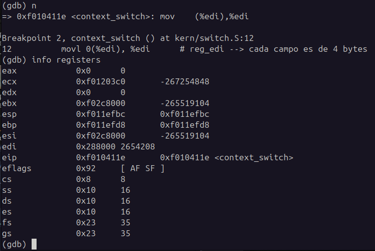
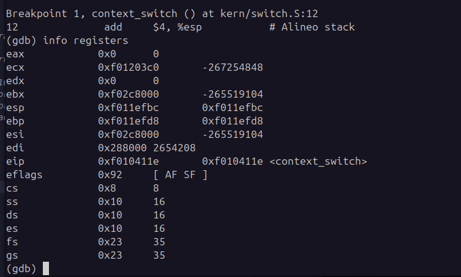
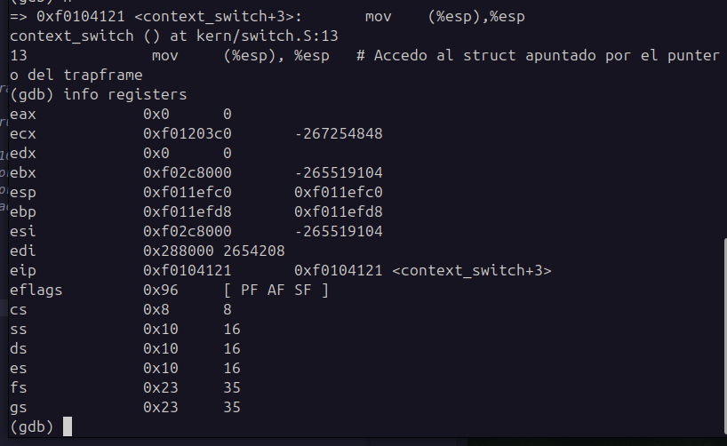
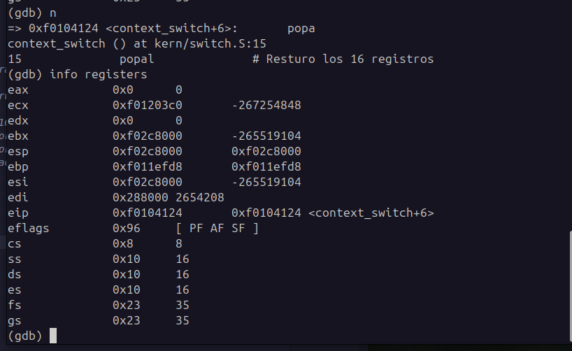
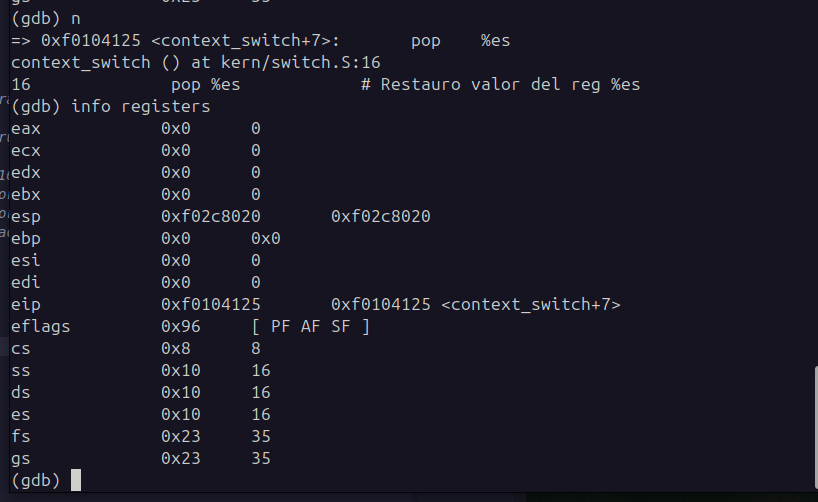
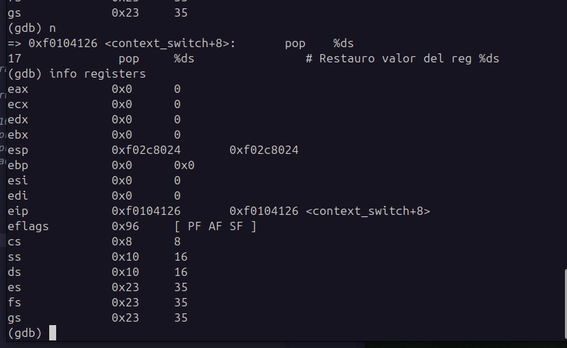
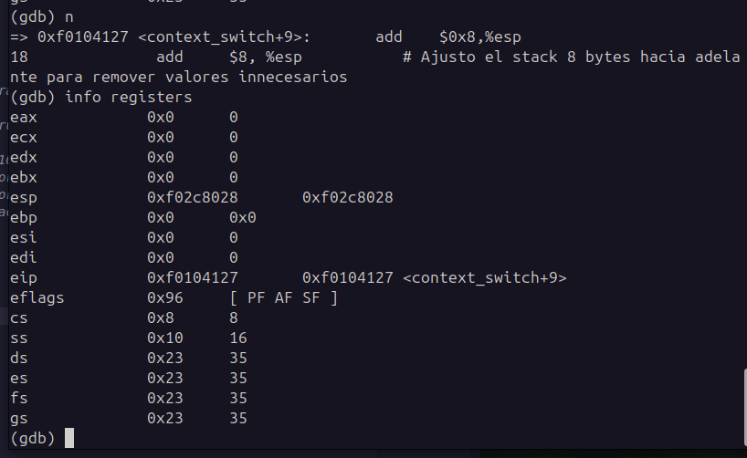
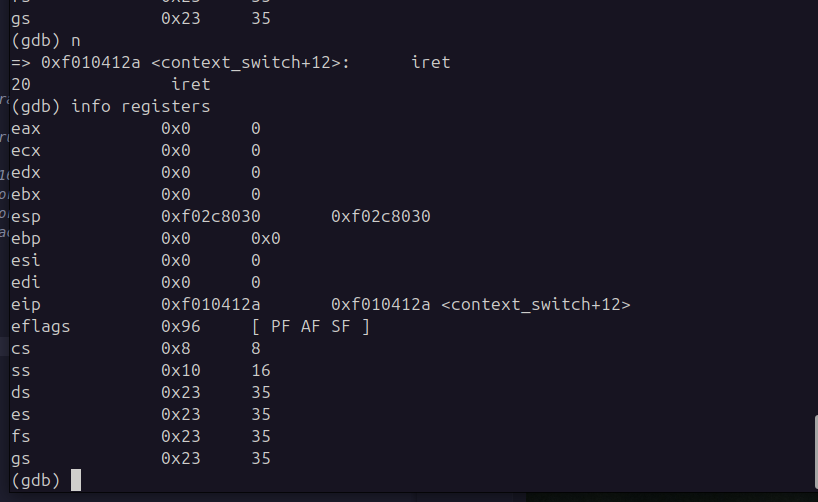
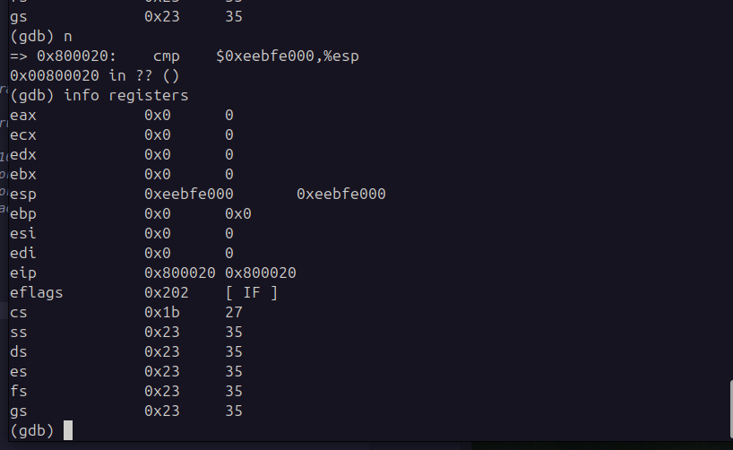

# sched

## Cambio de Contexto
Utilizar GDB para visualizar el cambio de contexto. Realizar una captura donde se muestre claramente:
- el cambio de contexto
- el estado del stack al inicio de la llamada de context_switch
- cómo cambia el stack instrucción a instrucción
- cómo se modifican los registros luego de ejecutar iret

### Llamado a context_switch()

Registros al entrar.

En este punto, dado que la función `context_switch` no retorna, no es necesario restaurar la dirección de retorno dejada por la llamada a `env_run`. Por lo que se puede acceder directamente al puntero del trapframe, cargado en el stack. 

Accedo al Struct **trapframe**.

Restauro registros generales.

Restauro registro `%es`.

Restauro registro `%ds`.

Droppeo los registros innecesarios del stack (**trapno**, **err**).

Se invoca `Iret` con el stack teniendo los registros (`eip`, `cs`, `eflags`, `esp` y `ss`)-

Registros luego de la llamada a Iret.
